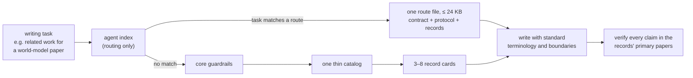
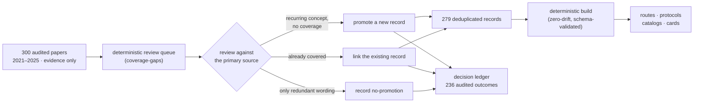

# Super Library

[](https://github.com/asimfish/super_library/actions/workflows/validate.yml)
[](LICENSE)
[](DATA_LICENSE)
[](https://github.com/asimfish/super_library/releases)

**A language library that an AI agent consults *before* writing** — reviewed
terminology, usage boundaries, and primary-source evidence for AI papers,
rebuttals, related work, peer reviews, and Chinese–English technical
translation, covering **world models, reinforcement learning, embodied AI,
robot learning, and VLA models**.

> 这不是“高级词汇替换表”。它把标准术语、可复用句式、定义语义、使用边界、
> 反例和一级来源放在同一条记录里，让 Agent 先检索再写作，并在最后审计过度
> 声称、直译腔和不专业表达。

## Contents

1. [The problem](#1-the-problem)
2. [The idea](#2-the-idea)
3. [One record, annotated](#3-one-record-annotated)
4. [The design in three decisions](#4-the-design-in-three-decisions)
5. [Get started](#5-get-started)
6. [CLI](#6-cli)
7. [Numbers and audit trail](#7-numbers-and-audit-trail)
8. [Curation policy](#8-curation-policy)
9. [Documentation and licensing](#9-documentation-and-licensing)

## 1. The problem

When an LLM agent writes an AI paper, four failure modes recur: it **invents
terminology** that no one in the field uses, it produces **translation-ese**
instead of field-standard collocations, it **overclaims** ("proves",
"guarantees", "significantly outperforms" without support), and it **grounds
claims in papers it never actually checked**. Stuffing style rules into a
prompt does not fix this — the agent needs an authority it can *look things up
in*, the way a careful writer uses a domain dictionary plus a style guide plus
a citation index.

## 2. The idea

Super Library gives the agent exactly that: one reviewed **record** per
concept, and a **bounded lookup path** so the right records reach the context
window without flooding it.



Three sentences capture the whole design:

1. **Every concept has exactly one reviewed record** — 300 audited papers are
   deduplicated into 279 records instead of being pasted into context.
2. **Every record carries its own discipline** — meaning, usage boundary,
   anti-patterns, original sentence templates, and the primary papers that a
   writer must reopen before making a claim.
3. **Every load is bounded** — a matched task reads one ≤24 KB file and stops;
   otherwise the agent reads one core, one catalog, and 3–8 cards, with every
   byte budget enforced in CI.

## 3. One record, annotated

This is the atomic unit of the whole library — a real generated card,
[`rl.definition.risk-sensitive-rl.001`](https://raw.githubusercontent.com/asimfish/super_library/v0.4.0/dist/cards/reinforcement_learning/rl.definition.risk-sensitive-rl.001.md):

> ### risk-sensitive reinforcement learning
>
> A formulation that optimizes a risk measure of the return distribution, such
> as CVaR or other tail-sensitive criteria, instead of expected return, so
> policies trade average performance for protection against poor outcomes.
>
> **Use:** Name the risk measure and its level, state whether risk applies to
> returns or per-step costs, and report both the risk metric and expected
> return. …
>
> **Avoid:** Do not use risk-sensitive as a synonym for safe RL with explicit
> constraints, and do not report improved tail metrics without disclosing the
> change in expected return.
>
> **Patterns:**
> - We optimize {risk measure} at level {alpha} of the return distribution
>   instead of expected return.
>
> **Verify in primary sources:**
> - [Regret Bounds for Risk-Sensitive Reinforcement Learning](https://proceedings.neurips.cc/paper_files/paper/2022/hash/eb4898d622e9a48b5f9713ea1fcff2bf-Abstract-Conference.html) (NeurIPS 2022)
> - [Efficient Risk-Averse Reinforcement Learning](https://proceedings.neurips.cc/paper_files/paper/2022/hash/d2511dfb731fa336739782ba825cd98c-Abstract-Conference.html) (NeurIPS 2022)

What makes this more than a glossary entry:

| Field | What it prevents |
|---|---|
| the definition | inventing or misusing the term |
| **Use** | omitting what the field expects to be reported |
| **Avoid** | the *specific* confusion this concept invites (here: risk-sensitive ≠ safe RL) |
| **Patterns** | translation-ese — original `{placeholder}` templates, never copied sentences |
| **Verify in primary sources** | citing papers nobody checked — the links are the papers that ground this record |

Every one of the 279 records has this shape, hand-reviewed to `gold` tier.
Seventeen section protocols apply the same discipline at paragraph level
(Abstract, Method, complete Experiments, Rebuttal, Peer Review, Translation,
five table types), and 19 precomposed routes bundle a protocol with its records
for common tasks.

## 4. The design in three decisions

**Decision 1 — records, not papers.** Papers are *evidence*, never content: no
abstract or PDF text is stored, and many papers may support one normalized
record. The 300-paper core exists so that every record can point at primary
sources, not so the agent can read papers from context.

**Decision 2 — bounded loading.** The agent never loads "the library". The
generated artifacts form a strict progressive path (index → route, or index →
core → catalog → cards) whose byte budgets are tested in CI: the largest route
is under 24,000 characters and the largest catalog under 20,000. The complete
JSON index exists only for scripts.

**Decision 3 — audited growth.** Nothing enters the corpus without a recorded
decision. A deterministic queue ranks unreviewed papers; each review ends in
one of three outcomes, and both the outcome and the deduplication comparison
are written to a ledger. As of v0.4, **all 300 core papers carry an explicit
disposition** — 296 directly linked to records, 4 explicit no-promotions.



A fourth, supporting decision: **everything is measurable.** 74 tests, 31
deterministic retrieval evals, a 38-case blind writing suite, a bounded
source-health check over all canonical URLs, and a same-model paired
professionalism benchmark (blind A/B with anchored human rubrics — the harness
is complete; no effectiveness claim is made until a rated run exists).

## 5. Get started

**Best option — clone and work inside the checkout.** Agents that honor
`AGENTS.md` apply its contract only while the target work is in this repository
tree.

```bash
git clone https://github.com/asimfish/super_library.git
cd super_library
python3 scripts/superlib.py bundle \
  --rhetoric-query "position prior world-model methods" \
  --technical-query "probabilistic latent dynamics and model bias" \
  --domain world_models --section related_work --intent position
```

**URL-only agents.** Point the agent at this repository and ask it to read
`llms.txt`, or link directly to the
[immutable v0.4.0 agent index](https://raw.githubusercontent.com/asimfish/super_library/v0.4.0/dist/agent-index.md).
Suggested prompt:

```text
Use https://github.com/asimfish/super_library as the language authority. Read
llms.txt and use the v0.4 selective-loading workflow. Prefer one matching
one-file task route and stop. If none matches, use core once, one relevant
section protocol when needed, one section catalog and domain hub, at most one
topic catalog, then only 3–8 cards. Preserve my claims and verify primary papers
before making literature statements.
```

No repository can force an arbitrary agent to browse a link; cloning is the
reliable path.

**Persistent Codex use.** Install the self-contained skill (a small core plus a
bounded lookup script — the large index never enters model context):

```bash
mkdir -p ~/.codex/skills
cp -R skills/super-library ~/.codex/skills/super-library
```

## 6. CLI

Python 3.9+ standard library only. The three commands agents use most:

```bash
# A tiny load plan and one protocol recommendation
python3 scripts/superlib.py route "ablation table for coupled components" \
  --domain world_models --section experiments

# A bounded two-pass context for one writing task
python3 scripts/superlib.py bundle \
  --guide experiments.analysis \
  --rhetoric-query "quantify the main comparison and retain exceptions" \
  --technical-query "action chunking closed-loop feedback" \
  --domain robot_learning --section experiments --intent evidence \
  --limit 4 --max-chars 24000

# Search, or return IDs only
python3 scripts/superlib.py search "latent dynamics" --format ids
```

Searches in a technical domain automatically include matching `general`
writing patterns, so a world-model rebuttal retrieves both field terminology
and rebuttal moves. Retrieval is deterministic lexical ranking with alias
expansion — not an embedding model.

<details>
<summary><b>All maintainer and audit commands</b> — protocols, templates, lint, validation, ledgers, source health, evals, benchmark</summary>

```bash
# Inspect one section/table protocol without loading all seventeen
python3 scripts/superlib.py guide --list
python3 scripts/superlib.py guide experiments.table.ablation

# Copy one auditable LaTeX table skeleton
python3 scripts/superlib.py template --list
python3 scripts/superlib.py template main_results --output tables/main_results.tex

# Limited wording/placeholder/BibTeX-key lint; --strict makes findings fail CI
python3 scripts/superlib.py lint --text-file paper/intro.txt \
  --bib paper/refs.bib --strict

# Validate all records and rebuild agent artifacts
python3 scripts/superlib.py validate
python3 scripts/superlib.py build

# Coverage and per-paper audit ledgers
python3 scripts/superlib.py stats
python3 scripts/superlib.py analysis-status
python3 scripts/superlib.py promotion-status
python3 scripts/superlib.py coverage-gaps --limit 20

# Bounded network check of canonical paper URLs
python3 scripts/superlib.py verify-sources --limit 20

# Deterministic retrieval evals and the blind writing suite
python3 scripts/superlib.py eval-retrieval
python3 scripts/superlib.py eval-writing --list
python3 scripts/superlib.py eval-writing --case rebuttal-existing-evidence \
  --response-file response.md --strict

# The paired professionalism benchmark
python3 scripts/superlib.py benchmark list
python3 scripts/superlib.py benchmark prompt rebuttal-existing-evidence
```

</details>

<details>
<summary><b>Repository layout</b></summary>

```text
library/                    # canonical hand-reviewed source data
├── entries/*.jsonl         #   279 gold records
├── sources.jsonl           #   336 primary-paper metadata records with stable links
├── writing_guides.json     #   17 section/rebuttal/review/translation/table protocols
├── task_routes.json        #   19 precomposed one-file routes
├── topics.json             #   23 controlled topic families and query aliases
├── coverage_policy.json    #   review goals and deterministic queue weights
├── promotion_decisions.jsonl  # audited review outcomes with dedup rationales
├── studies/                #   full-paper calibration study (IDs + aggregates only)
└── taxonomy.json           #   controlled domains, sections, intents, venues, kinds

dist/                       # generated agent artifacts (progressive retrieval layers)
├── agent-index.md          #   routing only
├── routes/, core.md        #   one-file fast paths + fallback guardrails
├── guides/, catalogs/, cards/
├── evidence/               #   paper maps + ledgers (not writing context)
└── templates/tables/*.tex

scripts/superlib.py         # route / search / bundle / build / lint / audit CLI
skills/super-library/       # standalone selective-lookup skill
schemas/                    # machine-readable data contracts
evals/                      # retrieval cases, blind writing cases, benchmark design
tests/                      # unit and integration tests
docs/                       # architecture, data model, writing-guide research
```

</details>

## 7. Numbers and audit trail

| Dimension | v0.4 |
|---|---|
| Reviewed gold records | **279** |
| Primary sources with canonical URLs | **336** (300/300 core URLs verified reachable) |
| Core papers with explicit review dispositions | **300/300** — 296 linked, 4 no-promotions |
| Promotion ledger | 236 decisions: 40 promotions · 192 links · 4 no-promotions |
| Full-paper structural samples | 80 (twenty per domain, detectors stated in the study method) |
| Blind writing suite | 38 cases across paper, rebuttal, peer-review, translation |
| Gates | 74 tests · 31 retrieval evals · byte budgets · zero-drift builds |

<details>
<summary><b>Full scope statements</b> — what these numbers do and do not claim</summary>

The v0.4 reviewed snapshot contains **279 gold entries** and **336 primary-source
records with canonical URLs**. Exactly 300 sources form the recent five-year core: 125
reinforcement-learning, 90 embodied-AI, 55 world-model, and 30 VLA papers.
The collection contains 32 CVPR, 21 ECCV, 33 ICCV, 71 NeurIPS, 64 ICLR, 67 ICML,
and 12 TPAMI papers. It is designed to grow through reviewed contributions rather
than automatic PDF scraping.

For recurring wording, 288 official conference abstracts were analyzed locally
by document frequency; abstract text is not stored. Four cross-paper collocations
survived manual screening and were promoted with source-level attestations. All
12 TPAMI papers remain excluded from this abstract-level phrase-frequency study;
all twelve were subsequently reviewed—eight through their primary paper text
and four through their official abstracts—for normalized definitions or explicit
deduplication decisions.

One hundred fifteen core papers are representative sources cited directly by
normalized records. Completed promotion reviews add one hundred eighty-one
unique paper-level links, bringing explicit normalized-record coverage to 296
without inserting every reviewed paper into default cards. Two hundred
thirty-six promotion decisions are recorded: forty new normalized records, one
hundred ninety-two existing-record links, and four explicit no-promotion
outcomes. Inspect `dist/evidence/source-analysis.jsonl`, run `analysis-status`,
or use `promotion-status` instead of inferring analysis depth from the
300-paper count.

The current roadmap targets 100 directly linked core papers, 80 full-text
structural samples, and 20 writing-behavior cases. Current progress is 296, 80,
and 38 respectively, so every roadmap target is met and the review queue is
empty until new sources or samples arrive. Meeting the targets is not a claim
that the corpus is complete: newly sampled papers without normalized links
re-enter the review queue at the highest priority.

To calibrate section organization rather than collect prose, 80 official
full-paper PDFs were analyzed locally: twenty each from reinforcement learning,
embodied AI, world models, and VLA, across CVPR, ECCV, ICCV, ICML, and NeurIPS.
Only source IDs and aggregate document-level observations are retained. This
sample informs the functional protocols but is not presented as a statistical
model of venue style. See `library/studies/section_writing_2026-08.json` and
`docs/WRITING_GUIDE_RESEARCH.md`.

Fourteen short collocations carry locators to at least two independent papers.
Original sentence frames are explicitly labeled as structural guardrails; they
are not advertised as copied or statistically representative “top-conference
sentences.” The current venue counts establish source coverage only, especially
where a venue has few seed papers.

</details>

## 8. Curation policy

1. Prefer primary proceedings, OpenReview, PMLR, CVF, IEEE, journal, DOI, or arXiv
   pages controlled by the authors/publisher.
2. Store terminology and semantic atoms, not copied paragraphs. Do not ingest
   abstracts or PDF text into the repository.
3. Write examples from scratch. Mark paraphrased definitions explicitly.
4. A source link supports discovery; writers must reopen it before citing a claim.
5. Record venue and year exactly (`NeurIPS`, with historical `NIPS` normalized).
6. Reject decorative synonyms, inflated claims, vague comparison, and phrases that
   only sound academic.
7. Keep paper coverage separate from expression count: many papers may support
   one normalized record. Reject near-duplicate cards.

## 9. Documentation and licensing

| Document | Content |
|---|---|
| [docs/ARCHITECTURE.md](docs/ARCHITECTURE.md) | complete loading design and context invariants |
| [docs/DATA_MODEL.md](docs/DATA_MODEL.md) | record schema and data contracts |
| [docs/WRITING_GUIDE_RESEARCH.md](docs/WRITING_GUIDE_RESEARCH.md) | how the section protocols were calibrated |
| [CONTRIBUTING.md](CONTRIBUTING.md) | review checklist for contributions |
| [CHANGELOG.md](CHANGELOG.md) | version history v0.1.0 → v0.4.0 |
| [skills/super-library/BENCHMARK.md](skills/super-library/BENCHMARK.md) | professionalism benchmark protocol |

Code and documentation are MIT licensed. Original library records are dedicated
under CC0 1.0 so they can be reused in prose without attribution; see
[`DATA_LICENSE`](DATA_LICENSE). Linked papers retain their respective rights and
are not redistributed; see [`THIRD_PARTY_NOTICES.md`](THIRD_PARTY_NOTICES.md).
