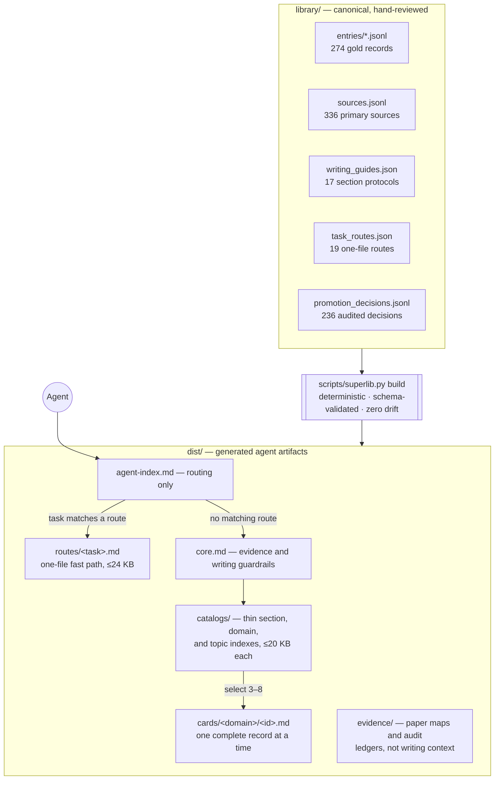
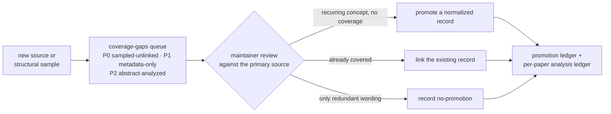

# Super Library

[](https://github.com/asimfish/super_library/actions/workflows/validate.yml)
[](LICENSE)
[](DATA_LICENSE)
[](https://github.com/asimfish/super_library/releases)

An **agent-ready, source-traceable language library** for writing AI papers,
rebuttals, related work, peer reviews, and technical translations with
field-standard terminology and disciplined research rhetoric.

> 这不是“高级词汇替换表”。它把标准术语、可复用句式、定义语义、使用边界、
> 反例和一级来源放在同一条记录里，让 Agent 先检索再写作，并在最后审计过度
> 声称、直译腔和不专业表达。

It covers **world models**, **reinforcement learning**, **embodied AI**,
**robot learning**, and **vision-language-action (VLA) models**, with source
coverage across ICLR, ICML, NeurIPS, CVPR, ECCV, ICCV, RSS, ICRA, IROS, TPAMI,
and AAAI. Venue is source metadata, not a claim that this seed corpus models a
venue-specific house style.

## Contents

1. [At a glance](#1-at-a-glance)
2. [How it works — architecture](#2-how-it-works--architecture)
3. [Give it to an agent](#3-give-it-to-an-agent)
4. [CLI quick start](#4-cli-quick-start)
5. [Repository layout](#5-repository-layout)
6. [What a record looks like](#6-what-a-record-looks-like)
7. [Corpus status and audit trail](#7-corpus-status-and-audit-trail)
8. [Quality machinery](#8-quality-machinery)
9. [Curation policy](#9-curation-policy)
10. [Documentation](#10-documentation)
11. [Licensing](#11-licensing)

## 1. At a glance

| Dimension | v0.4 |
|---|---|
| Reviewed gold records | **274** (definitions, terms, sentence patterns, usage notes, collocations, anti-patterns) |
| Primary sources | **336**, every one with a canonical URL |
| Audited 2021–2025 core papers | **300**, indexed into 23 topic families |
| Explicit review dispositions | **300/300** — 296 directly linked, 4 recorded no-promotions |
| Promotion ledger | **236 decisions** with evidence locators and deduplication rationales |
| Section protocols | **17** (Abstract → Conclusion, Rebuttal, Peer Review, Translation, five table types) |
| One-file task routes | **19**, each capped at 24,000 characters |
| Blind writing suite | **38 cases** across paper, rebuttal, peer-review, and translation modes |
| Tests and evals | 74 unit/integration tests, 31 deterministic retrieval evals, deterministic builds with zero artifact drift |

Recurring terminology and writing moves are **deduplicated into compact
reusable records** rather than copied once per paper. A policy-driven promotion
queue prioritizes the next nonredundant paper reviews without entering normal
agent context, and a decision ledger records whether each reviewed paper
promoted a new record, reused an existing record, or warranted no promotion.

## 2. How it works — architecture

Canonical data lives in `library/`, is compiled deterministically into `dist/`,
and agents load the generated artifacts through a bounded, progressive path —
the large JSON index never enters model context.



The corpus grows through an audited review loop, never by automatic PDF
scraping:



The generated `router.json` records byte budgets and every route.
`catalog.jsonl` is a thin machine catalog; `index.json` is the complete offline
index and should be queried by a script, not pasted into an agent.

## 3. Give it to an agent

**Best option — clone and work inside the checkout.** Agents that honor
`AGENTS.md` apply its contract only while the target work is in this repository
tree; a sibling clone is not automatically in scope.

```bash
git clone https://github.com/asimfish/super_library.git
cd super_library
python3 scripts/superlib.py bundle \
  --rhetoric-query "position prior world-model methods" \
  --technical-query "probabilistic latent dynamics and model bias" \
  --domain world_models --section related_work --intent position
```

**URL-only agents.** Give the agent this repository URL and ask it to read
`llms.txt`, or link directly to the small
[immutable v0.4.0 agent index](https://raw.githubusercontent.com/asimfish/super_library/v0.4.0/dist/agent-index.md).
The index first offers one-file task routes for the four core domains; a
matching route already contains the compact contract, one protocol when needed,
and its selected records, so the agent reads that file and stops. Unmatched
tasks fall back to one universal core, one section catalog, one small domain
hub, at most one topic catalog, and only 3–8 full entry cards.

Suggested prompt:

```text
Use https://github.com/asimfish/super_library as the language authority. Read
llms.txt and use the v0.4 selective-loading workflow. Prefer one matching
one-file task route and stop. If none matches, use core once, one relevant
section protocol when needed, one section catalog and domain hub, at most one
topic catalog, then only 3–8 cards. Preserve my claims and verify primary papers
before making literature statements.
```

No repository can force an arbitrary agent to browse a link. The contract above
works when the agent can read GitHub; cloning is the reliable path.

**Persistent Codex use.** Install the self-contained skill after cloning:

```bash
mkdir -p ~/.codex/skills
cp -R skills/super-library ~/.codex/skills/super-library
```

The installed skill contains a small core plus a machine index. Its bundled
lookup script returns only the requested records. Keep the full checkout when
you also want context bundles, linting, source maintenance, and deterministic
builds.

## 4. CLI quick start

The tools use only the Python standard library (Python 3.9+). The three
commands agents use most:

```bash
# Get a tiny load plan and one protocol recommendation
python3 scripts/superlib.py route "ablation table for coupled components" \
  --domain world_models --section experiments

# Build a bounded two-pass context for one writing task
python3 scripts/superlib.py bundle \
  --guide experiments.analysis \
  --rhetoric-query "quantify the main comparison and retain exceptions" \
  --technical-query "action chunking closed-loop feedback" \
  --domain robot_learning --section experiments --intent evidence \
  --limit 4 --max-chars 24000

# Search or return IDs only
python3 scripts/superlib.py search "latent dynamics" --format ids
```

<details>
<summary><b>All maintainer and audit commands</b> — protocols, templates, lint, validation, ledgers, source health, evals, benchmark</summary>

```bash
# Inspect one section/table protocol without loading all seventeen
python3 scripts/superlib.py guide --list
python3 scripts/superlib.py guide experiments.table.ablation

# Copy one auditable LaTeX table skeleton
python3 scripts/superlib.py template --list
python3 scripts/superlib.py template main_results --output tables/main_results.tex

# Limited wording/placeholder/BibTeX-key lint; --strict makes findings fail CI
python3 scripts/superlib.py lint --text-file paper/intro.txt \
  --bib paper/refs.bib --strict

# Validate all records and rebuild agent artifacts
python3 scripts/superlib.py validate
python3 scripts/superlib.py build

# Show coverage
python3 scripts/superlib.py stats

# Audit aggregate or per-paper analysis depth
python3 scripts/superlib.py analysis-status
python3 scripts/superlib.py analysis-status <source-id> --format json

# Inspect completed promotion/deduplication decisions
python3 scripts/superlib.py promotion-status
python3 scripts/superlib.py promotion-status <source-id> --format json

# Perform a current, bounded network check of canonical paper URLs
python3 scripts/superlib.py verify-sources --limit 20

# Execute deterministic top-k, guide, and task-pack routing cases
python3 scripts/superlib.py eval-retrieval

# List blind writing cases, then score one response (manual review still required)
python3 scripts/superlib.py eval-writing --list
python3 scripts/superlib.py eval-writing --case rebuttal-existing-evidence \
  --response-file response.md --strict

# Inspect the professional A/B benchmark and emit a condition-neutral prompt
python3 scripts/superlib.py benchmark list
python3 scripts/superlib.py benchmark prompt rebuttal-existing-evidence

# Rank the next papers for normalization/deduplication review
python3 scripts/superlib.py coverage-gaps --limit 20
```

</details>

Technical-domain searches automatically include matching `general` writing
patterns, so a world-model rebuttal can retrieve both field terminology and
rebuttal moves. For mixed tasks, retrieve in two passes: use `section` +
`intent` for rhetorical moves, then query technical terms/definitions by
`domain` without a section filter. The search is deterministic lexical ranking
with alias expansion — not a semantic embedding model.

## 5. Repository layout

```text
library/                    # canonical hand-reviewed source data
├── entries/*.jsonl         #   274 gold records
├── sources.jsonl           #   336 primary-paper metadata records with stable links
├── writing_guides.json     #   17 functional section/rebuttal/review/translation/table protocols
├── task_routes.json        #   19 precomposed one-file routes (≤24,000 chars rendered)
├── topics.json             #   23 controlled topic families and query aliases
├── collections.json        #   auditable paper-selection policies and minimums
├── coverage_policy.json    #   review goals and deterministic queue scoring weights
├── promotion_decisions.jsonl  # audited review outcomes with dedup rationales
├── studies/                #   bounded full-paper calibration study (IDs + aggregates only)
├── table_templates.json    #   five LaTeX table assets with SL_* replacement tokens
├── taxonomy.json           #   controlled domains, sections, intents, venues, kinds
└── core_ids.json           #   the deliberately small universal-core selection

dist/                       # generated agent artifacts (progressive retrieval layers)
├── agent-index.md          #   routing only
├── routes/, core.md        #   one-file fast paths + fallback guardrails
├── guides/, catalogs/, cards/
├── evidence/               #   paper maps + analysis/promotion ledgers (not writing context)
└── templates/tables/*.tex

scripts/superlib.py         # route / search / bundle / build / lint / audit CLI
skills/super-library/       # standalone selective-lookup skill (bounded lookup script)
schemas/                    # machine-readable data contracts
evals/                      # retrieval cases, 38 blind writing cases, professionalism benchmark
tests/                      # 74 unit and integration tests
docs/                       # architecture, data model, writing-guide research
```

## 6. What a record looks like

Each entry binds an expression to its safe semantics, usage boundary, and
primary evidence — definitions are paraphrases and example sentences are
original templates:

| Field | Content |
|---|---|
| `expression` | recommended term or pattern |
| `meaning` | the semantic content it is safe to convey |
| `guidance` / `avoid` | usage boundary and common failure mode |
| `examples` | original templates with `{placeholders}` |
| `source_ids` | primary sources to verify before making scientific claims |
| `provenance` | original pattern · terminology · independently paraphrased synthesis · multi-source attested collocation |

## 7. Corpus status and audit trail

The v0.4 reviewed snapshot contains **274 gold entries** and **336 primary-source
records with canonical URLs**. Exactly 300 sources form the recent five-year core: 125
reinforcement-learning, 90 embodied-AI, 55 world-model, and 30 VLA papers.
The collection contains 32 CVPR, 21 ECCV, 33 ICCV, 71 NeurIPS, 64 ICLR, 67 ICML,
and 12 TPAMI papers. It is designed to grow through reviewed contributions rather
than automatic PDF scraping.

For recurring wording, 288 official conference abstracts were analyzed locally
by document frequency; abstract text is not stored. Four cross-paper collocations
survived manual screening and were promoted with source-level attestations. All
12 TPAMI papers remain excluded from this abstract-level phrase-frequency study;
all twelve were subsequently reviewed—eight through their primary paper text
and four through their official abstracts—for normalized definitions or explicit
deduplication decisions.

One hundred fifteen core papers are representative sources cited directly by
normalized records. Completed promotion reviews add one hundred eighty-one
unique paper-level links, bringing explicit normalized-record coverage to 296
without inserting every reviewed paper into default cards. Two hundred
thirty-six promotion decisions are recorded: forty new normalized records, one
hundred ninety-two existing-record links, and four explicit no-promotion
outcomes. **Every core paper now carries an explicit review disposition**: 296
are directly linked and the remaining four are recorded no-promotion outcomes.
Inspect `dist/evidence/source-analysis.jsonl`, run `analysis-status`, or use
`promotion-status` instead of inferring analysis depth from the 300-paper count.
See `library/corpus_report.json` and `library/promotion_decisions.jsonl`.

The current roadmap targets 100 directly linked core papers, 80 full-text
structural samples, and 20 writing-behavior cases. Current progress is 296, 80,
and 38 respectively, so every roadmap target is met, all 80 sampled papers
carry reviewed normalized-record links, and the review queue is empty until
new sources or samples arrive. Meeting the targets is not a claim that the
corpus is complete: newly sampled papers without normalized links re-enter the
review queue at the highest priority. `coverage-gaps` ranks the next review
candidates; reviewers may record `record_no_promotion` when a paper adds only
redundant wording.

To calibrate section organization rather than collect prose, 80 official
full-paper PDFs were analyzed locally: twenty each from reinforcement learning,
embodied AI, world models, and VLA, across CVPR, ECCV, ICCV, ICML, and NeurIPS,
with the move detectors stated explicitly in the study's method field.
Only source IDs and aggregate document-level observations are retained. This
sample informs the functional protocols but is not presented as a statistical
model of venue style. See `library/studies/section_writing_2026-08.json` and
`docs/WRITING_GUIDE_RESEARCH.md`.

Fourteen short collocations carry locators to at least two independent papers.
Original sentence frames are explicitly labeled as structural guardrails; they
are not advertised as copied or statistically representative “top-conference
sentences.” The current venue counts establish source coverage only, especially
where a venue has few seed papers.

## 8. Quality machinery

- **Deterministic gates.** Schema validation, 74 unit and integration tests, 31
  deterministic retrieval evals, byte budgets on every selective-context file,
  and a zero-drift check between generated artifacts and the commit — all
  enforced by `make check` and CI.
- **Blind writing suite.** 38 cases check final-output facts and evidence
  boundaries across paper, rebuttal, peer-review, and translation modes;
  machine checks cover objective invariants only.
- **Paired professionalism benchmark.** A same-model A/B design compares
  writing with and without the library through randomized blind review: six
  anchored quality dimensions, critical-error flags, paired bootstrap
  uncertainty, and rater-agreement reporting. The harness is reproducible and
  locally executable; no measured effectiveness claim is made until a completed
  blind run is reviewed. See
  [skills/super-library/BENCHMARK.md](skills/super-library/BENCHMARK.md).
- **Source health.** A bounded network check verifies every canonical paper
  URL; 404/410 fail the strict mode.

## 9. Curation policy

1. Prefer primary proceedings, OpenReview, PMLR, CVF, IEEE, journal, DOI, or arXiv
   pages controlled by the authors/publisher.
2. Store terminology and semantic atoms, not copied paragraphs. Do not ingest
   abstracts or PDF text into the repository.
3. Write examples from scratch. Mark paraphrased definitions explicitly.
4. A source link supports discovery; writers must reopen it before citing a claim.
5. Record venue and year exactly. `NeurIPS` is the current venue name; historical
   `NIPS` aliases are normalized.
6. Reject decorative synonyms, inflated claims, vague comparison, and phrases that
   only sound academic.
7. Keep paper coverage separate from expression count: many papers may support
   one normalized term or comparison pattern. Reject near-duplicate cards and
   route full paper lists through per-topic evidence maps outside default context.

## 10. Documentation

| Document | Content |
|---|---|
| [docs/ARCHITECTURE.md](docs/ARCHITECTURE.md) | complete loading design and context invariants |
| [docs/DATA_MODEL.md](docs/DATA_MODEL.md) | record schema and data contracts |
| [docs/WRITING_GUIDE_RESEARCH.md](docs/WRITING_GUIDE_RESEARCH.md) | how the section protocols were calibrated |
| [CONTRIBUTING.md](CONTRIBUTING.md) | review checklist for contributions |
| [CHANGELOG.md](CHANGELOG.md) | version history v0.1.0 → v0.4.0 |
| [skills/super-library/BENCHMARK.md](skills/super-library/BENCHMARK.md) | professionalism benchmark protocol |

## 11. Licensing

Code and documentation are released under the MIT License. Original library
records are dedicated under CC0 1.0 so they can be reused in prose without
attribution; see [`DATA_LICENSE`](DATA_LICENSE). Linked papers retain their
respective rights and are not redistributed; see
[`THIRD_PARTY_NOTICES.md`](THIRD_PARTY_NOTICES.md).
